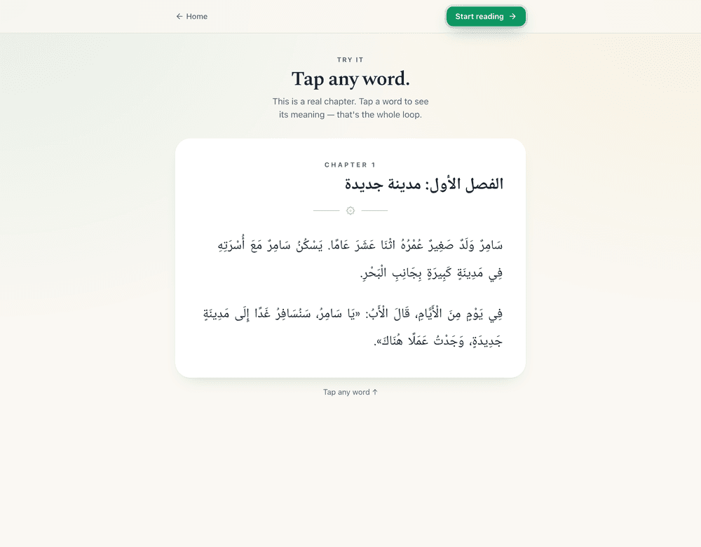

<p align="center">
  
</p>

<h1 align="center">Maqra — مقرأ</h1>

<p align="center"><strong>Read real Arabic books, beautifully.</strong><br/>
Tap any word to translate, save it to a spaced-repetition deck, and finish books.</p>

<p align="center">
  <a href="https://arabic-xp.vercel.app">Live app →</a>
</p>

<p align="center">
  
  
  
  
</p>

<p align="center">
  
  
</p>

---

> Reading Arabic is hard because one unknown word breaks the flow and you never
> finish the book. Maqra removes the dictionary friction — tap a word, get the
> lemma + meaning in context, keep reading — and measures real outcomes (books
> finished, words mastered, days in a row) instead of an abstract level.

## What it does

- **Read in-app, page by page.** Every book is split into chapters, paginated into
  comfortable screen pages with a progress bar, text-size control, and page tints.
- **Tap-to-translate.** Tap any Arabic word → its dictionary form (lemma), a
  contextual English gloss, part of speech, and an example. Lookups are generated by
  Claude and cached **globally**, so a given word is only looked up once across all users.
- **Save → spaced repetition.** Saved words flow into an SM-2 review queue (`/review`)
  with tap-to-flip flashcards and Again / Hard / Good / Easy grading. `/words` groups
  every saved word by strength (New → Mastered).
- **Bring your own books.** Drop an `.epub`; it's parsed in the browser into real
  chapters, and one click of AI fills difficulty, genre, and blurb and regroups
  badly-split EPUBs. Low-quality OCR scans are detected and flagged before import.
- **Optional comprehension test.** Reading a book to its last page completes it; a
  Claude-graded whole-book test is available but never required.

## Difficulty tiers

Curated books are grouped by a coarse tier shown to the reader — **Beginner /
Intermediate / Advanced** (`tierFor` in `components/book/BookCover.tsx`, derived from
the advisory `books.level`). The tier is a signal and a shelf, not a ladder you must
climb: progress is measured by **books finished**, **words mastered**, and **streak**.

The curated catalogue is famous public-domain and original work only — an original
graded reader (رحلة سامر), Juha folk tales, the Arabian Nights frame, al-Nawawi's 40
Hadith, Forty Hadith Qudsi, Kalila wa Dimna. (In-app text is always public-domain,
original, or a reader's own private upload — never fabricated copyrighted text.)

## Free vs Pro

Maqra is freemium, billed through **Stripe**.

| | Free | **Pro** |
| --- | --- | --- |
| Curated Beginner shelf | ✅ | ✅ |
| Intermediate & Advanced books | — | ✅ |
| Bring your own EPUBs | — | ✅ |
| Spaced-repetition deck | up to 50 words | unlimited |
| Daily AI limits (lookups / quizzes / tests) | modest | high |

`lib/entitlement.ts` is the single source of truth (`getPlan` / `canReadTier`); every
gate is enforced **server-side** (book page, reader route, test route, upload action,
AI quota). Emails in `ADMIN_EMAILS` are **auto-Pro**. A Stripe webhook
(`/api/stripe/webhook`) keeps the `subscriptions` table in sync.

## Auth

- **Sign in** — email + password.
- **Create account** — email + password, confirmed by a **6-digit code** (Supabase
  email OTP, `type=signup`). No magic-link sign-in.

---

## Stack

- **Next.js 15** App Router · TypeScript strict · React 19
- **Tailwind v4** (tokens are CSS variables in `app/globals.css` `@theme`) · Framer
  Motion · lucide-react
- **Supabase** Auth + Postgres + RLS
- **Drizzle ORM** — typed schema in `lib/db/schema.ts`, migrations in `db/migrations/`
- **Anthropic SDK** (Claude) — word lookups, chapter quizzes, whole-book tests, upload
  analysis, with ephemeral prompt caching on system blocks
- **Stripe** — Pro subscriptions (Checkout + Billing Portal + webhook)
- **jszip** — client-side EPUB parsing (no server upload pipeline)
- **Vercel** deployment

## Local development

```bash
pnpm install
cp .env.example .env.local      # Supabase, DATABASE_URL/DIRECT_URL, ANTHROPIC_API_KEY, (Stripe optional)
pnpm db:push                    # apply the Drizzle schema
pnpm db:seed                    # difficulty bands, curated on-ramp books + chapters, achievements
pnpm dev                        # http://localhost:3000
```

**Supabase from a laptop:** the direct DB host (`db.<ref>.supabase.co`) is IPv6-only
and often won't resolve locally — point `DATABASE_URL` / `DIRECT_URL` at the **session
pooler** (`aws-<n>-<region>.pooler.supabase.com:5432`, user `postgres.<ref>`).

**Admin / curated uploads:** add your email to `ADMIN_EMAILS` (comma-separated). Admins
are auto-Pro and their uploads become **public** catalogue books; everyone else's
uploads are **private** to them.

Scripts: `pnpm db:generate`, `pnpm db:studio`, `pnpm test` (Vitest), `pnpm lint`, `pnpm build`.

## Billing setup (Stripe)

Billing is optional — without Stripe env the app runs free-only and `/upgrade` shows
"coming soon". To enable Pro:

1. `STRIPE_SECRET_KEY=sk_… pnpm tsx scripts/stripe-setup.ts` — idempotently creates the
   **Maqra Pro** product + monthly/annual prices; prints the price IDs.
2. Add a webhook endpoint → `https://YOUR_DOMAIN/api/stripe/webhook`, events
   `checkout.session.completed` + `customer.subscription.*`; copy its signing secret.
3. Set env: `STRIPE_SECRET_KEY`, `STRIPE_WEBHOOK_SECRET`, `STRIPE_PRICE_MONTHLY`,
   `STRIPE_PRICE_ANNUAL`, and `NEXT_PUBLIC_APP_URL`.

`scripts/stripe-backfill.ts` reconciles the `subscriptions` table with Stripe if a
webhook delivery is ever missed. Use **test** keys locally, **live** keys only on the host.

## The EPUB pipeline

`/upload` → drop an `.epub`:

1. **Parse in the browser** (`lib/books/epub.ts`, jszip). Reads the OPF for metadata,
   then the book's own TOC (EPUB3 `nav` / EPUB2 `toc.ncx`) for **real chapter
   boundaries**, merging spine pages between them; falls back to one chapter per spine
   document. OCR accuracy banners are stripped and bad scans flagged (`lib/books/quality.ts`).
2. **Auto-fill with AI** (optional — `lib/ai/book-analyze.ts`). Claude reads only short
   excerpts and returns a difficulty band, genre, blurb, and a page→chapter grouping
   that drops front/back matter. Whole books are never sent to the model.
3. **Preview & save** — `createBookWithChapters` writes the book + chapters and stamps
   `owner_id`.

## Routes

| Route | Purpose |
| --- | --- |
| `/` | Signed-out landing |
| `/sign-in` | Password sign-in · code-confirmed sign-up |
| `/path` | **Read** — Continue hero, tier shelves (Beginner/Intermediate/Advanced), your library |
| `/book/[slug]` | Book detail: cover, chapters, start reading, optional test |
| `/book/[slug]/read/[chapter]` | The page-by-page reader + tap-to-translate |
| `/book/[slug]/test` | Optional whole-book comprehension test |
| `/words` · `/review` | Saved words · SM-2 flashcards |
| `/upload` | Add a book (EPUB importer + AI) — **Pro** |
| `/upgrade` | Pricing + Stripe checkout |
| `/settings` · `/stats` | Plan & profile · reading stats |
| `/privacy` · `/terms` | Legal |

## Key files

- `lib/db/schema.ts` — data model (`books.owner_id`, `user_books`, `book_chapters`,
  `vocab_items`, `streaks`, `subscriptions`, …)
- `lib/entitlement.ts` — plan / Pro gates · `lib/stripe/*` — Stripe client, checkout, webhook sync
- `lib/books/{epub,split,quality}.ts` — EPUB → chapters, OCR-scan detection
- `lib/ai/{word-lookup,chapter-quiz,test-generator,book-analyze,quota}.ts` — Claude features + rate limits
- `components/reader/ChapterReader.tsx` · `components/upload/AddBook.tsx`
- `app/(app)/path/page.tsx` — the Read catalogue · `app/(auth)/sign-in/page.tsx` — auth
- `lib/srs/sm2.ts` — pure SM-2 (unit-tested) · `lib/xp/{rewards,grant}.ts` — XP math

## Conventions

- Arabic uses the `font-arabic` utility and `dir="rtl"` (Noto Naskh Arabic, Amiri
  fallback). The logo is the Arabic wordmark مقرأ in Amiri.
- All in-app text is **public-domain, original, or a reader's own private upload** —
  there is no public user-generated catalogue.
- No `tailwind.config.ts` — tokens live in `app/globals.css`.
- Vitest covers pure logic (SM-2, XP curve, slugify, EPUB splitter, OCR quality).
